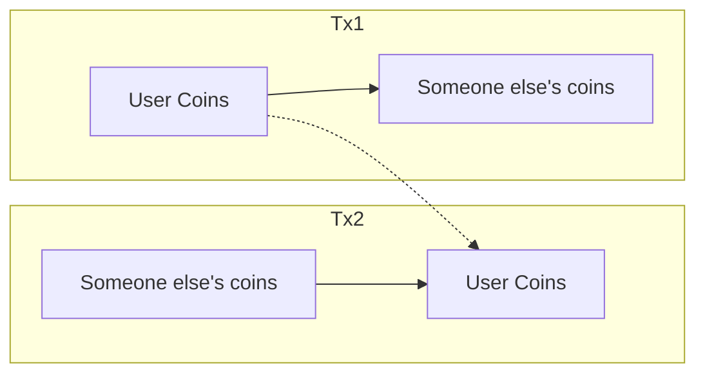
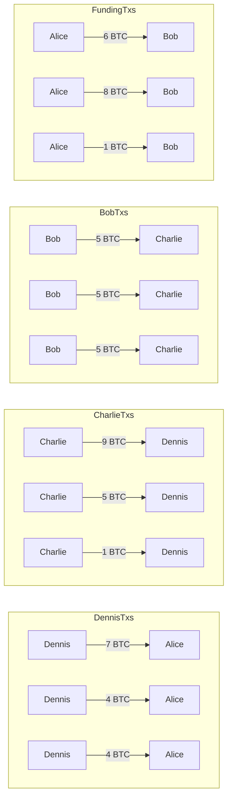
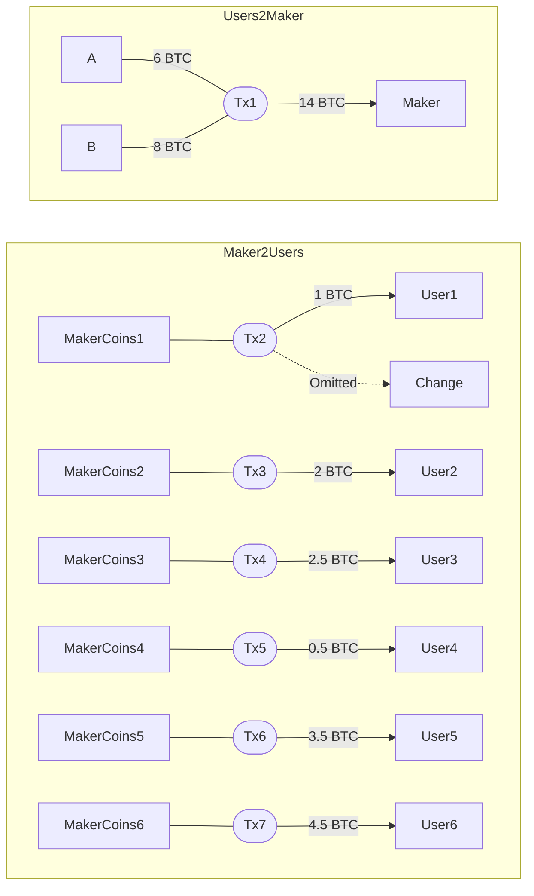
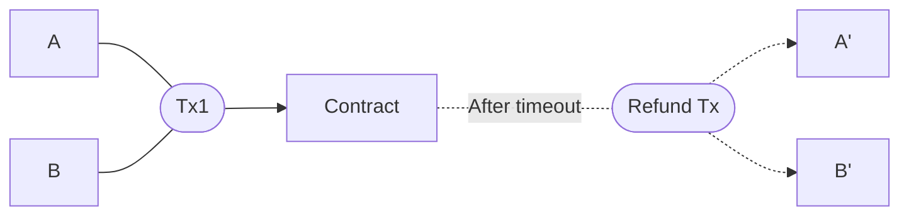
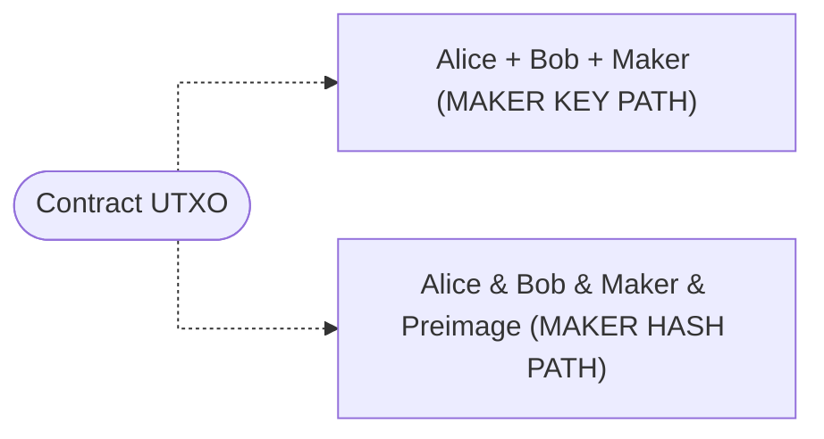
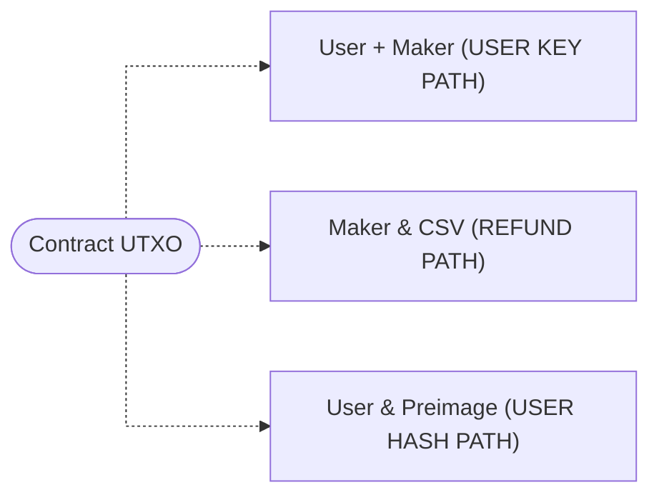
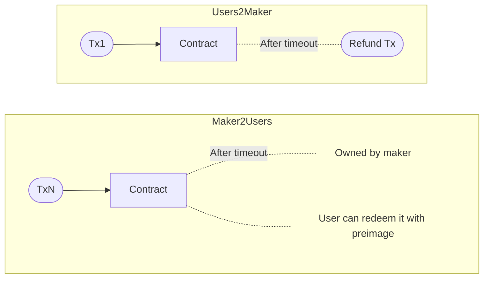
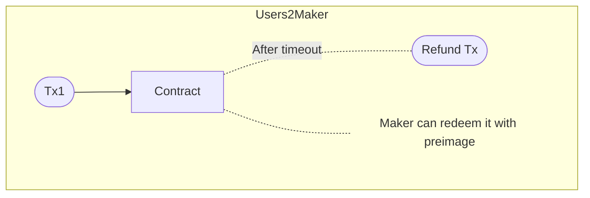
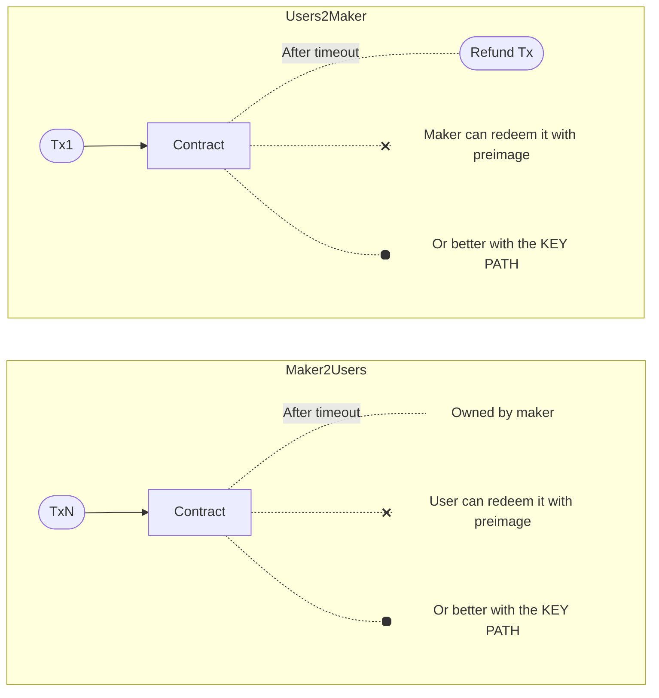

# JoinSwap

Welcome to the JoinSwap prototype repository! A JoinSwap (🔀🔄) is a Bitcoin privacy technique that blends features of both CoinJoin and CoinSwap.

The prototype includes two distinct binary files:

* For the end-user.
* For the maker (also known as the liquidity provider).

To test it, assuming you have [Rust](https://www.rust-lang.org/) installed:

1. Open 3 terminal windows and navigate to the downloaded source code directory using ``cd path/to/directory`` (replace with the actual path).
2. Initiate the maker protocol in one terminal window with ``cargo run --bin maker_protocol``.
3. Launch the user protocol in the other two terminal windows with ``cargo run --bin user_protocol`` (currently, it's designed for 2 users).

You will see some messages with weird emojis 🐸 and arrows describing the process during execution. Note that this prototype focuses on the fundamental logic of the protocol and does not yet interface with a blockchain backend—it's purely demonstrative at this stage.

Continue reading below to delve into the workings of JoinSwap and specific details about this prototype.

## Intro

From the point of view of a passive observer, a JoinSwap is a CoinSwap since user's coins don't move from inputs to outputs of a transaction. Rather these coins move from inputs of ``Tx1`` to outputs of ``Tx2``. This is the magic of CoinSwap: coins (i.e. funds associated with one entity) move in ways that leave no direct footprint.

However, since the values of the ``Tx1`` input and ``Tx2`` output are the same or very close, it's easy to link them using amount correlation. For this reason, in [Chris Belcher's CoinSwap design](https://gist.github.com/chris-belcher/9144bd57a91c194e332fb5ca371d0964) the user receives a fraction of the coins in 3 separate transactions. Finding the true recipients is now harder and can lead to false positives if there are unrelated transactions that happen to add up to a similar amount.

Still the maker (the one with whom you are swapping coins) knows exactly what happened. As elaborated in the previous document, to gain privacy against the maker we have to use multi-hop swaps, where each maker will not know if the person she is swapping coins with is the user or another maker in the path. Here is an example with Alice as user and Bob, Charlie and Dennis as makers (note that each arrow is a transaction that uses unique addresses):

Hence, a multi-hop CoinSwap requires paying miner fees for multiple transactions (3 per maker) and the 1-3 initial transaction(s) to the first maker, plus fees for each maker. As you can imagine this can be quite expensive for regular use.

One of the main motivations of JoinSwap is achieving maker side privacy in a cheaper way. Here is where the CoinJoin features come into play.

### A CoinJoin inside a CoinSwap

JoinSwap deviates from Chris Belcher's CoinSwap by using a single hop and allowing multiple users to participate. Users build a joint transaction (thus breaking the common-input-ownership heuristic) sending their coins to an address that will ultimately be owned by the maker, and the maker sends her money, using different transactions, to addresses that will ultimately be owned by the users as well.

Since it's one hop, users pay for 3 transactions or so to prevent amount correlation, plus the transaction to the maker which is jointly paid between the users/input owners (hence it's cheaper). Finally, there's a single maker fee, paid as a difference between the money sent to the maker and the money received.

Because we have different users coins, we can perform a CoinJoin under the hood. Consider two users, _A_ and _B_, possessing UTXOs of 6 and 8 BTC respectively. Just like a traditional CoinJoin, they register these inputs under an identity and receive a blinded certificate. Subsequently, they reconnect with a fresh ID to register the outputs. The difference is that the inputs and outputs are not contained within a single transaction.

``User1`` to ``User6`` are new identities not linked to _A_ and _B_. From the point of view of the maker, there are multiple interpretations. Some of the many possible readings are: 
* _A_ received her money in ``Tx2``, ``Tx5`` and ``Tx7`` (1 + 0.5 + 4.5 = 6 BTC).
* Or it could be in ``Tx3``, ``Tx5`` and ``Tx6`` (2 + 0.5 + 3.5 = 6).
* Or in ``Tx4`` and ``Tx6`` (2.5 + 3.5 = 6).
* Or it could even be the case that there's a payjoin happening here and _A_ sent _B_ 0.5 BTC and received her money in ``Tx2``, ``Tx3`` and ``Tx4``! (1 + 2 + 2.5 = 5.5).

However, the rest of blockchain observers will not be aware that these transactions are related at all. And in the worst case, in which the transaction link is known (adversarial maker), users still have the privacy of a CoinJoin.

### Taproot Addresses

The current code is using P2WSH (Pay to Witness Script Hash) addresses, although the idea is to use P2TR (Pay to TapRoot) addresses with a MuSig2 aggregated public key in the key path.

Taproot addresses are quite common now, and they provide the benefit of removing the complexity of pre-signed contract transactions, as contract policies are hidden in the script paths, and replacing ECDSA-2P (proposed in Chris Belcher CoinSwap) with MuSig2 aggregated keys involving potentially more than 2 parties.

Taproot improves Bitcoin fungibility and simplifies the creation of private contracts. We believe next generation privacy tools should leverage these benefits.

### Privacy implications

Much like CoinSwaps, JoinSwap offers enhanced privacy not only for its participants but also for many Bitcoin users who aren't directly involved. Any regular taproot transaction may actually be teleporting coins, owned by different parties, to other transaction outputs. This makes the transaction graph analysis used until now unreliable.

In general the users-to-maker transaction will have several inputs and one output. As a result, UTXO consolidation transactions become more private, given the increased potential interpretations. Another variation of the users-to-maker transaction could have an additional output where some user paid money to. This setup allows a user to make payments while simultaneously teleporting the change output. Right now the safest assumption by far (from the point of view of the payment recipient) is that the payer controlled all the inputs and received the change in the second output, but with JoinSwap payments this assumption is completely broken.

With respect to the maker-to-users transactions, these would usually have 1-3 input(s) and 2 outputs, which are common today.

A JoinSwap can take many different forms which means its anonymity set is broad (at least within the taproot world) and gives plausible deniability to its users. With just a small percentage of Bitcoin transactions being JoinSwaps, analyzing the actual movement of coins would become very hard.

## Protocol Workflow

In the protocol, the maker takes the role of a coordinator server, for example to combine Partially Signed Bitcoin Transactions (PSBTs) together.

The protocol starts with creation of the users-to-maker transaction. For this, the users send the maker some public keys, the UTXOs to spend from, and a refund address. The maker uses this data to build a contract, a transaction sending the user coins to it (``Funding Tx`` or users-to-maker Tx) and a relative timelocked transaction that spends from the contract UTXO back to each user refund address (``Refund Tx``).

The users receive the contract data along with these unsigned transactions and verify they are correct. The contract will have two policy paths: one that requires each participant to sign and another that also requires revealing the preimage of a hash (which is only known by the maker at this stage). Let's assume two users, Alice and Bob.

##### Users-to-maker contract

> "+" denotes a key aggregation while "&" is used for a N-of-N multisig

The ``Refund Tx`` spends from the MAKER KEY PATH, and can only be mined after some blocks have passed since the ``Funding Tx`` was mined. This enforces that even with uncooperative participants you are guaranteed to get the money back after a timeout.

So the users sign the ``Refund Tx`` and send it to the maker, which combines the two PSBTs and signs it herself. She sends the fully signed ``Refund Tx`` to the participants that can now sign the ``Funding Tx`` without risk. The maker combines these PSBTs again and broadcasts the finalized transaction.

At this point the users-to-maker transaction is done (``Tx1``), but the maker cannot redeem the user coins without both Alice and Bob's consent, and for that she needs to create the maker-to-users transactions. If from now on some party stops cooperating or doesn't follow the protocol, the users wait for the timeout and publish ``Refund Tx``.

To create the maker-to-users transactions (``Tx2`` - ``Tx7``), users receive blinded certificates, connect to the maker with new identities and send her a new set of public keys. The maker then creates the contracts and sends the respective amount of money to each one. The contracts will have 3 policy paths.

##### Maker-to-users contract

Because the money comes only from the maker, we guarantee the refund with a policy path that can be spent entirely by her after some time (relative locktime enforced with CSV). Moreover, the hash path can be spent entirely by the user if he knows the preimage. Note that for each contract, the maker doesn't know if the user key is owned by Alice or Bob, as the keys were registered with new IDs.

If the correct transactions aren't mined or the data isn't sent to the users within a period of time, the user will abort and await the timeout. On the other hand, if the transactions are correctly mined and data sent in a timely manner, users simultaneously send (to prevent timing correlation) their private keys from the MAKER HASH PATH: ``Alice & Bob & Maker & Preimage``.

These private keys must be sent with the old IDs as they are associated with them e.g. if new ID _X_ sends the private key that corresponds to Alice, then the maker will of course know _X_ is Alice (the CoinJoin is broken).

If users do not respond or deviate from the protocol the maker aborts and will own each maker-to-users UTXO after the CSV enforced timeout, without having to publish any refund transaction. Users will have to pay for the ``Refund Tx`` jointly.

But if users cooperate, the maker will have all the necessary data (all private keys and preimage) to redeem the user coins with the MAKER HASH PATH, which would require revealing the preimage in the blockchain, that would in turn allow the users to redeem the maker coins with the USER HASH PATH: ``User & Preimage``.

#### Quick Recap
1. The users-to-maker transaction is created, with a refund transaction that unlocks after a timeout, and then mined
2. The users change IDs and the maker-to-users transactions are created and mined (each one associated with a new ID)

3. The users allow the maker to redeem their coins if she reveals the preimage in the blockchain, by giving her the needed private keys

Nonetheless, completing the swap with the HASH PATHs is a bad outcome, as it reveals the link between all the transactions (the hash is the same for all of them). Instead, to properly complete the swap, **users and makers exchange their private keys associated to the KEY PATHs**.

First the maker sends to each new ID her private key from the corresponding USER KEY PATH: ``User + Maker``. If she doesn't do it within a period of time, users will as before wait to publish ``Refund Tx``. The other possibility is that the maker spends the user coins using the MAKER HASH PATH, by publishing the preimage in the blockchain, forcing users to use the USER HASH PATH as well. Users end up paying fees to the maker without gaining any privacy and exposing them.

However, the maker is economically incentivized not to redeem user coins from the MAKER HASH PATH. First because spending from it requires a few signatures plus the preimage, which is more expensive than the KEY PATH spend in terms of miner fees. And most importantly because the users will blacklist the specific maker forever (for this there needs to be some kind of maker public IDs).

If the previous step completes as expected, the users can now redeem the maker coins with the USER KEY PATH while the maker can yet only redeem the user coins with the MAKER HASH PATH.

The final step requires the users to send at the same time, and using the old IDs as before, their private key from the MAKER KEY PATH: ``Alice + Bob + Maker``. If users don't follow the protocol the maker will have to use the MAKER HASH PATH while users will be able to use the USER KEY PATHs. This is less catastrophic for privacy as the maker-to-users transactions are not linked to the first one, but still reveals that users participated in a contract, which defeats the JoinSwap purpose.

Nonetheless, it's expected that participants will follow the protocol at each point, since deviating from it carries both economical and privacy costs. If the last step concludes successfully, both users and the maker can spend using the KEY PATHs, resulting in transactions indistinguishable from typical single-sig ones.

Note that the maker needs to spend her UTXO before ``Refund Tx`` becomes valid and the users need to spend their respective UTXOs before the timeout. Also note that under normal circumstances users will not learn the preimage (and it will not be needed).

And that finalizes the JoinSwap!

## Future Work

As mentioned earlier, the prototype currently does not incorporate taproot, leaving the contracts exposed. Hence, next steps are integrating MuSig2 with taproot such that the contracts remain hidden in the cooperative case. Furthermore, the CoinJoin is the step that probably requires more thought, especially about how the amounts are divided and registered. Luckily CoinJoins are widely used and researched, so we expect it to be feasible to integrate an effective CoinJoin in the protocol.
